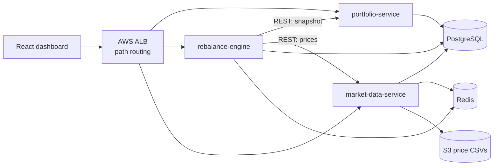

# TaxLot — Portfolio Rebalancing & Tax-Loss Harvesting Engine

> Read this file completely before starting any phase. It is the single source of truth for what TaxLot is, why it exists, how it's built, and what to do next. Built for a Morgan Stanley Parametric (Spring Analyst Program, Mumbai — SDE track) application.

---

## 1. What this project is (plain language)

A wealthy client hands a firm money and says: "Invest this like the S&P 500, but manage it for me personally." Instead of buying one index fund, the firm buys each stock in the index individually, in the client's own account. This is called **direct indexing** — it's Parametric's (Morgan Stanley Investment Management) core business.

Doing this by hand creates two everyday problems. TaxLot is software that solves both, automatically, for thousands of accounts at once.

**Problem 1 — the portfolio drifts out of shape.** The plan says 5% in Apple. Apple's price rises, and it quietly becomes 8%. The client is now taking more risk than agreed. TaxLot checks every account daily, finds what's out of balance, and proposes the exact trades to fix it. This is **rebalancing**.

**Problem 2 — the client pays more tax than necessary.** Some holdings are sitting at a loss. Selling them locks in that loss, which legally reduces the client's tax bill — but the client shouldn't lose market exposure. TaxLot sells the losing stock and immediately buys a similar one (e.g. sells Apple, buys Microsoft) so the client stays invested. This is **tax-loss harvesting (TLH)**.

**The catch:** by law, if you sell a stock at a loss and buy the same (or a "substantially identical") stock back within 30 days either side, the tax loss is disallowed. This is the **wash-sale rule**, and TaxLot must never break it.

---

## 2. Why this project (fit to the target role)

| Role requirement | How TaxLot proves it |
|---|---|
| Java, algorithms & data structures | Java 21 services; lot selection, drift math, optimisation logic |
| Cloud-native AWS microservices | 3 Spring Boot services, Dockerised, deployed on AWS |
| RDBMS and NoSQL | PostgreSQL (accounts, lots, trades) + Redis (prices, locks) |
| Functional, integration & performance testing | JUnit, Testcontainers, Gatling |
| Java + Selenium + BDD automation | Cucumber feature files + Selenium on the dashboard |
| Passion for the financial industry | Real direct-indexing mechanics: tax lots, wash sales, tracking error |
| AI-assisted development | Built end-to-end with Claude Code, documented here |

---

## 3. Domain — the 9 terms you must know cold

| Term | Meaning | Memory hook |
|---|---|---|
| Tax lot | One batch of shares bought on one date, one price | A "receipt" for one purchase |
| Cost basis | What you paid for a lot | The receipt's price tag |
| Unrealised gain/loss | Paper profit/loss — current value minus cost basis | "On paper," not real yet |
| Realised gain/loss | Profit/loss once you actually sell | "Cashed in" — now taxable |
| Short-term vs long-term | Held ≤ 1 year = short-term (taxed higher); > 1 year = long-term (taxed lower) | Short-term = impatient = pays more tax |
| Drift | Current weight minus target weight | A recipe gone wrong — too much of one ingredient |
| HIFO | Sell the highest-cost lot first | Sell the priciest receipt first — shrinks the taxable gain |
| Wash sale | Sell at a loss, rebuy same stock within 30 days → loss disallowed | "No do-overs within 30 days" |
| Direct indexing | Own the index's stocks individually, not one ETF | Buy every ingredient yourself instead of a ready meal |

### Worked example (redo this by hand before coding)

```
Bought:  100 shares of AAPL at $200      → cost basis = $20,000
Now:     AAPL price = $170               → market value = $17,000
Loss:    $20,000 − $17,000 = $3,000 unrealised loss

Sell all 100 shares → loss becomes REALISED
Tax saved ≈ $3,000 × 35% = $1,050

Buy ~$17,000 of MSFT (same sector) → stays invested in tech
Block AAPL purchases for the next 30 days → wash-sale rule
```

If you can redo this from memory and explain each line, you're ready to code.

---

## 4. Architecture

Three Spring Boot services share one PostgreSQL database (separate schemas) and one Redis instance. Local dev runs on Docker Compose; AWS runs the same images.



| Service | Owns | Responsibilities |
|---|---|---|
| `market-data-service` | Securities, sectors, prices, substitutes | Security master; price simulator; CSV loader from S3; Redis price cache |
| `portfolio-service` | Models, accounts, exclusions, tax lots, trades, realised gains | CRUD; account snapshot endpoint; applies fills to lots; wash-sale blocks |
| `rebalance-engine` | Proposals, proposed trades | Drift + TLH computation; validation; batch runs; approval workflow |
| `engine-core` (library) | Pure domain logic | Lot selection, drift, TLH, substitutes, validators — no Spring, no I/O |

### Tech stack

Java 21 · Spring Boot 3.3 · Spring Data JPA · Maven multi-module · PostgreSQL 16 + Flyway · Redis 7 · springdoc-openapi · Resilience4j · React 18 + Vite · JUnit 5 / AssertJ / Mockito / Testcontainers · Cucumber 7 · Selenium 4 · Gatling · GitHub Actions → Amazon ECR · AWS EC2 (+ S3, stretch: ECS Fargate + RDS) · Spring Actuator + Micrometer.

Use `BigDecimal` for all money and quantities — never `double`.

Set an AWS billing alarm at $5 before deploying anything.

### Data model

```sql
security(id, ticker UNIQUE, name, sector)
price(security_id, price_date, close NUMERIC(18,4), PRIMARY KEY(security_id, price_date))
substitute(security_id, substitute_id, rank)
model(id, name)
model_weight(model_id, security_id, target_weight NUMERIC(9,6))
account(id, name, model_id, cash NUMERIC(18,2), drift_threshold, tlh_enabled,
        st_tax_rate, lt_tax_rate, min_cash_pct, version)
exclusion(account_id, security_id)
tax_lot(id, account_id, security_id, quantity NUMERIC(18,4), cost_per_share,
        acquired_date, status OPEN|CLOSED)
wash_sale_block(account_id, security_id, blocked_until)
proposal(id, account_id, status DRAFT|APPROVED|REJECTED|EXECUTED, created_at,
         est_tax_saved, input_snapshot JSONB, idempotency_key)
proposed_trade(id, proposal_id, security_id, side BUY|SELL, quantity, price,
               lot_id NULL, reason_code TLH_SELL|TLH_SUB_BUY|DRIFT_SELL|DRIFT_BUY)
realized_gain(id, account_id, lot_id, quantity, proceeds, cost_basis,
              term SHORT|LONG, realized_date)
```

### Key API endpoints

| Service | Endpoint | Purpose |
|---|---|---|
| market-data | `GET /securities`, `GET /prices/latest?tickers=` | Security master, latest prices |
| market-data | `POST /prices/simulate?days=N` | Advance simulated prices |
| portfolio | `POST /accounts`, `GET /accounts/{id}/snapshot` | Account CRUD + full snapshot |
| portfolio | `GET /accounts/{id}/drift`, `/losses` | Drift and harvestable losses |
| rebalance | `POST /rebalance/{accountId}?tlh=true` | Create a draft proposal |
| rebalance | `POST /rebalance/batch` | Rebalance all accounts |
| rebalance | `POST /proposals/{id}/approve` (needs `Idempotency-Key`) | Approve and execute |

### Rebalance algorithm (engine-core)

1. **Snapshot** — load lots, cash, prices, model weights, exclusions, active wash-sale blocks. Take a Redis lock on the account.
2. **Adjust targets** — remove excluded stocks from the model, give their weight to the top-ranked allowed substitute.
3. **TLH pass** — for each open lot with a loss > $500 and 5%, and not wash-sale blocked: sell (`TLH_SELL`), then buy the best allowed substitute (`TLH_SUB_BUY`), and block the sold stock for 30 days.
4. **Drift pass** — recompute weights; sell overweights in tax-aware order (losses → long-term gains → short-term gains, HIFO within each); buy underweights, skipping blocked stocks.
5. **Constraints** — keep a minimum cash buffer, round to whole shares, drop trades under $100 notional.
6. **Validate** — an independent `ProposalValidator` re-checks every invariant (no wash-sale breach, no excluded buy, no negative cash, no overselling a lot). Any failure rejects the whole proposal.
7. **Persist** — save the proposal with its input snapshot and estimated tax saved. On approval, fills apply, lots close/split, realised gains are recorded.

Batch runs use Java 21 virtual threads (bounded by a semaphore, e.g. 50), a per-account Redis lock (30s TTL), optimistic locking via `account.version`, and an idempotency key on approval.

---

## 5. Testing strategy

| Layer | Tools | Target |
|---|---|---|
| Unit | JUnit 5, AssertJ, Mockito | >80% coverage on `engine-core` |
| Property-based | jqwik | 1,000 random cases per invariant |
| Integration | Testcontainers (real Postgres + Redis) | Every endpoint covered |
| Contract | WireMock | Happy path + timeout + 500 between services |
| BDD functional | Cucumber 7 | 15+ scenarios |
| UI automation | Selenium 4 (Page Object Model) | 5 flows, headless Chrome in CI |
| Performance | Gatling | p95 < 200ms single; 1,000 accounts < 60s batch |

Example scenario:

```gherkin
Feature: Tax-loss harvesting

  Scenario: Harvest a lot with a large unrealised loss
    Given account "ACC-1" holds 100 shares of "AAPL" bought at 200.00 on "2026-03-01"
    And the current price of "AAPL" is 170.00
    When I run a rebalance with TLH enabled
    Then the proposal contains a SELL of 100 "AAPL" with reason "TLH_SELL"
    And the proposal contains a BUY of "MSFT" with reason "TLH_SUB_BUY"
    And the estimated tax saved is 1050.00
```

Give every interactive UI element a `data-testid` from day one.

---

## 6. Repo layout

```
taxlot/
├── CLAUDE.md              (this file)
├── docs/                  PRD.md, TRD.md, domain-primer.md
├── pom.xml                Maven parent
├── common/                DTOs, enums (Side, ReasonCode, Term), money utils
├── engine-core/           pure Java: LotSelector, DriftCalculator, TlhPlanner,
│                          SubstituteSelector, WashSaleChecker, ProposalValidator
├── market-data-service/
├── portfolio-service/
├── rebalance-engine/
├── bdd-tests/             Cucumber features, step defs, Selenium page objects
├── perf-tests/            Gatling simulations
├── ui/                    React + Vite dashboard
├── infra/                 docker-compose.yml, EC2 setup script
└── .github/workflows/ci.yml
```

## 7. Build rules (Claude Code must follow these)

- All money and quantities are `BigDecimal` (scale 2 for money, 4 for quantity, `RoundingMode.HALF_EVEN`). Never `double`.
- `engine-core` has **no Spring, no I/O**. Pure functions over immutable records.
- Every new class in `engine-core` gets JUnit 5 + AssertJ tests in the same change.
- Schema changes only through Flyway migrations (`V{n}__description.sql`). Never edit an applied migration.
- Every UI element that tests touch has a `data-testid`.
- Reason codes: `TLH_SELL`, `TLH_SUB_BUY`, `DRIFT_SELL`, `DRIFT_BUY`.
- Wash-sale window: 30 days either side of a loss sale.
- Propose a plan and wait for approval before writing code.
- Keep changes to one phase per session. Run `mvn verify` before saying a task is done.
- Do not add dependencies not listed in the tech stack above without asking.

Commands:
```
mvn verify                                  # build + all tests
mvn -pl engine-core test                    # engine tests only
docker compose -f infra/docker-compose.yml up -d   # local stack
```

---

## 8. Phase-by-phase build plan

Do not start a phase until the previous phase's "done when" passes. ~21 working days total at 3–4 hrs/day.

### Phase 0 — Setup (Day 1)
**Build:** Git repo, Maven parent with all modules, Docker Compose (Postgres 16 + Redis 7), GitHub Actions running `mvn verify`, this CLAUDE.md in place.
**Claude Code prompt:**
> Read CLAUDE.md and docs/. Scaffold the Maven multi-module project, Docker Compose for Postgres 16 and Redis 7, and a GitHub Actions workflow running mvn verify. Plan first.
**Done when:** `docker compose up` starts both containers; CI is green on an empty build.

### Phase 1 — Market data (Days 2–3)
**Build:** Security master seeded with 30 stocks across 6 sectors, substitutes table, 1 model ("US Large Cap 30"), random-walk price simulator, latest prices cached in Redis.
**Claude Code prompt:**
> Build market-data-service per CLAUDE.md: security, price and substitute tables via Flyway, seed data from the Seed universe table below, a random-walk price simulator, and latest prices cached in Redis. Include integration tests with Testcontainers.
**Done when:** `POST /prices/simulate?days=30` moves prices; `GET /prices/latest` is served from Redis.

### Phase 2 — Portfolio (Days 4–6)
**Build:** Accounts, exclusions, tax lots, snapshot, drift and losses endpoints, fills that close/split lots and write realised gains.
**Claude Code prompt:**
> Build portfolio-service per CLAUDE.md: accounts, exclusions, tax lots, snapshot, drift, losses and fills endpoints. Fills must close or split lots and write realised gains with SHORT/LONG term. Write a test that checks drift against a hand calculation.
**Done when:** seed 3 accounts; drift and losses match a hand calculation in a test.

### Phase 3 — Engine (Days 7–11) — split into 3 sessions, this is the core
**3a — Claude Code prompt:**
> In engine-core, implement LotSelector (tax-aware HIFO), DriftCalculator and WashSaleChecker with full unit tests. No Spring. Show me the plan and the test cases first.

**3b — Claude Code prompt:**
> Implement TlhPlanner, SubstituteSelector and ProposalValidator following the 7-step algorithm in CLAUDE.md. Add a test that reproduces the worked example exactly.

**3c — Claude Code prompt:**
> Build rebalance-engine: proposal endpoints, approve/reject with Idempotency-Key, Redis account lock, Resilience4j on calls to other services.

**Done when:** unit tests >80% on `engine-core`; the worked example produces the exact trades.

### Phase 4 — Functional tests (Days 12–13)
**Build:** Testcontainers integration tests, WireMock contract tests, 15 Cucumber scenarios.
**Claude Code prompt:**
> Create bdd-tests with Cucumber 7. Implement the tax-loss harvesting scenario above, then add: wash-sale block, excluded-stock block, drift-within-threshold no-op, insufficient-cash scaling, HIFO picks highest-cost lot, long-term preferred over short-term gain, rejected proposal changes nothing, double-approve with same idempotency key executes once. Add WireMock contract tests for the engine.
**Done when:** `mvn verify` runs everything green in CI.

### Phase 5 — Dashboard (Days 14–16)
**Build:** React pages (accounts list, account detail, proposal review with approve/reject); Selenium page objects + 5 flows.
**Claude Code prompt:**
> Build the React dashboard in ui/ with data-testid on every control: accounts list, account detail (holdings, lots, drift, losses), proposal review with approve/reject. Then add Selenium 4 page objects and 5 flows as Cucumber scenarios running headless Chrome.
**Done when:** Selenium suite passes headless in CI.

### Phase 6 — Scale (Days 17–18)
**Build:** Batch rebalance with virtual threads, Resilience4j, a 1,000-account synthetic generator, Gatling simulations.
**Claude Code prompt:**
> Add batch rebalance with virtual threads and a semaphore of 50, a generator for 1,000 synthetic accounts, and Gatling simulations for single and batch rebalance.
**Done when:** Gatling report shows the p95 <200ms and 1,000 accounts <60s targets. Save the HTML report.

### Phase 7 — Ship (Days 19–21)
**Build:** Docker images to ECR, deploy on one EC2 with Compose, S3 CSV loader, README with architecture diagram, 2-minute demo video.
**Claude Code prompt:**
> Write Dockerfiles, push to ECR from CI, and an EC2 setup script using docker compose. Write a README with the problem, architecture diagram, design decisions and Gatling results.
**Done when:** public URL works; README explains the problem, design and results with real numbers.

### Stretch (only after Phase 7)
- Backtest: replay 1 year of real prices, report tax alpha vs. buy-and-hold.
- Tracking-error estimate via a covariance matrix of returns.
- Replace sync REST between engine and portfolio with SQS/Kafka events.
- Move to ECS Fargate + RDS with Terraform.

### Seed universe

| Sector | Stocks | Substitute pairs |
|---|---|---|
| Tech | AAPL, MSFT, NVDA, GOOGL, META | AAPL↔MSFT, NVDA↔GOOGL, META↔GOOGL |
| Financials | JPM, BAC, GS, MS, WFC | JPM↔BAC, GS↔MS |
| Healthcare | JNJ, PFE, UNH, MRK, ABBV | JNJ↔PFE, MRK↔ABBV |
| Consumer | AMZN, WMT, KO, PEP, MCD | KO↔PEP, WMT↔AMZN |
| Energy | XOM, CVX, COP, SLB, EOG | XOM↔CVX |
| Industrials | CAT, DE, HON, GE, UPS | CAT↔DE |

Prices are simulated — tickers are labels only. Real historical CSVs are a Phase 7 add-on.

---

## 9. Working tips

- Read and understand every file Claude Code writes — interviews will be about your code, not Claude's.
- Write the worked-example test yourself before asking Claude Code to implement TLH.
- After each phase, ask Claude Code "explain this module as if I'm being interviewed on it" and take notes.
- Commit per phase with clear messages.
- One Claude Code session per phase (split Phase 3 into 3a/3b/3c). Start each in plan mode.

---

## 10. Resume bullets (fill in numbers once measured)

**TaxLot — Portfolio Rebalancing & Tax-Loss Harvesting Engine** | Java 21, Spring Boot, PostgreSQL, Redis, AWS, Cucumber, Selenium

- Built a direct-indexing engine across 3 Spring Boot microservices that rebalances custom portfolios and harvests tax losses using tax-lot HIFO selection, same-sector substitutes and 30-day wash-sale enforcement.
- Rebalanced [1,000] accounts in [X]s using Java 21 virtual threads with Redis per-account locking and idempotent approvals; p95 single-account latency [Y]ms under Gatling load tests.
- Automated [15+] Cucumber BDD scenarios and 5 Selenium UI flows plus Testcontainers integration tests at [85]% engine coverage; CI/CD via GitHub Actions to AWS (EC2, ECR, S3).

---

## Ready-to-build checklist

- [ ] Can explain tax lot, cost basis, realised vs unrealised without notes
- [ ] Can explain why HIFO reduces tax vs FIFO
- [ ] Can explain the wash-sale rule and why a substitute is bought
- [ ] Redid the worked example from memory
- [ ] JDK 21, Maven, Docker, Node 20, Git, Claude Code installed and verified
- [ ] Repo created with this file at the root

All checked → open Claude Code in the repo, enter plan mode (Shift+Tab), and run the Phase 0 prompt.
